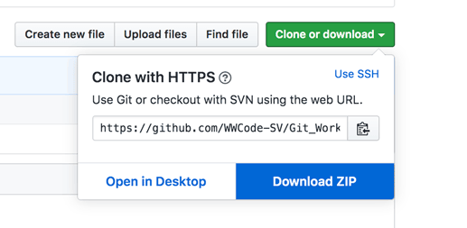
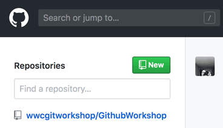
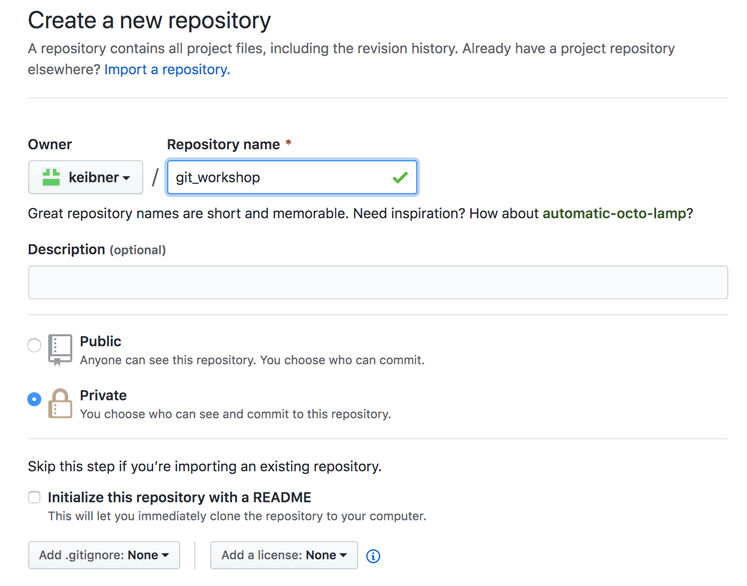
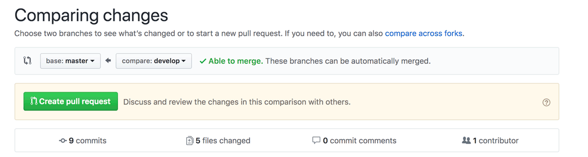
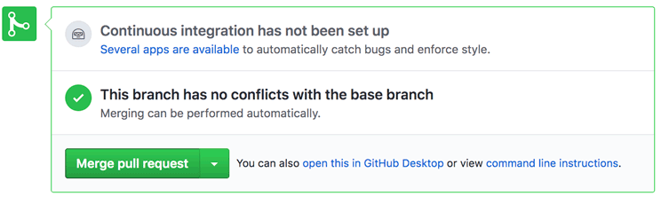
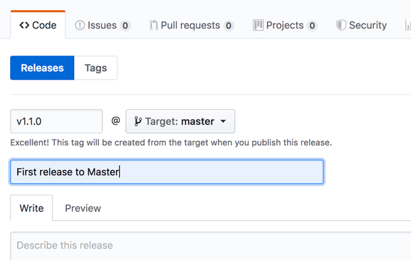
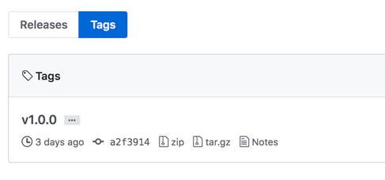

# advanced-git

## Set up your Repository
  
[Download the starting files](https://github.com/WWCode-SV/Git_Workshop)<br/>

<br/>

Go to your personal GitHub and create a new empty repository<br/>

<br/>

Set up the repository<br/>

<br/>

Clone your repository to your local file system

```bash
$ git clone https://github.com/<username>/<repo_name>
$ cd <repo_name>
```

Save the downloaded files to your new repo<br/>

Add all files and commit 
```bash
$ git add *
$ git commit -m "Inital commit"
$ git push
```


## Rebase from Remote

**Make a branch**

```bash
git checkout -b summer-theme
```

**make a small change to this branch** <br/>
*add styling to public/css/styles.css*
```bash 
a {
    font-variant: small-caps;
}
```
*commit this change*
```bash
$ git add public/css/styles.css
$ git commit -m "update link font"
```
**Make another small change to this branch**<br/>
*add styling to public/css/styles.css*
```bash 
body {
    background-color: #f4d086;
    ...
}

#brand-color {
  color: #ff9f1c;
}
```

*commit this change*
```bash
$ git add public/css/styles.css
$ git commit -m "orange colorway"
```

**Make a third small change to this branch** <br/>
*add styling to public/css/styles.css*
```bash 
* {
  font-family: Georgia, serif;
}
```

*commit this change*
```bash
$ git add public/css/styles.css
$ git commit -m "Georgia font"
```

**Switch to the original branch**
```bash 
$ git checkout master
```

**Create a new file and add / commit / push**
```bash
$ echo "causing commit history differences so we can rebase, yay" > rebase.txt
$ git add rebase.txt
$ git commit -m "rebase magic time"
```

**Checkout your feature branch and rebase**
```bash
$ git checkout summer-theme
$ git log --oneline
$ git diff master
$ git rebase master
$ git log --oneline
```
*note the difference in your commit history*

## Rebase -i
**Switch the order of two commits**

```bash
$ git rebase -i HEAD~3
```
*looks at the last three commits*

<!-- <br/> -->

	pick #####  orange colorway 
*move this line up or down*
*save and close*

**Reword one of your commit comments**<br/>
*allows you to change your comment, but not the commit itself*
```bash
$ git rebase -i HEAD~3
```

	reword ##### update link font 
*save and close*

Edit commit message --> "small caps link font"
*save and close*

```bash
$ git log --oneline
```

**Edit commit**<br/>
*allows you to change the commit itself*
```bash
$ git rebase -i HEAD~3 
```
	edit ###### orange colorway 
*save and close*

*change color styling in public/css/styles.css*
```bash 
body{
  background-color: #90c97c;
  padding-top: 3.5rem;
}

#brand-color {
  color: #ee7a8f;
}

```

```bash
$ git add public/css/styles.css
$ git commit --amend -m "watermelon colorway"
$ git status
$ git rebase --continue
$ git log --oneline
```


**Squash commit**<br/>
*allows you to combine commits*
```bash
$ git rebase -i HEAD~3
```

	pick ###### Georgia font
	squash ###### watermelon colorway
	*save and close*


## Stash <br/>
*allows you to temporarily store changes in order to perform another command*

```bash
$ touch brainstorm.txt
$ git add brainstorm.txt
$ echo "theme colorway brainstorm: watermelon, beach, .." > brainstorm.txt
$ git commit brainstorm.txt -m "creating ideas for colors"
$ git checkout master
```
error: Your local changes to the following files would be overwritten by checkout:
	brainstorm.txt
Please commit your changes or stash them before you switch branches.
Aborting
```bash
$ git stash
$ git checkout master
```
*look around*
*back to summer-theme*

```bash
$ git checkout summer-theme
$ git stash list
$ git stash pop
$ git add . 
$ git commit
git log --oneline
```
or you can use 
```bash
$ git stash apply stash@{#}
```
instead of
```bash
$ git stash pop
```

## Reset 
**Reset a staged file**<br/>

Make a change to your brainstorm.txt file<br/>
Check the status
```bash
	$ git status
```

View the Staging Index
```bash
	$ git ls-files -s
```
>ls-files is a utility for inspecting the Staging Index. Adding -s or --stage flag gives us the SHA-1 hash

Add your change file to Staging
```bash
	$ git add brainstorm.txt
```
Now view the Staging Index and note the change to your file
```bash
	$ git ls-files -s
```
Unstage the file, and review the status
```bash
	$ git reset HEAD brainstorm.txt
	$ git status 
```
> TIP: By default, *git reset* uses --mixed option. This will remove the changed file from staging, but NOT reset the changes. If you used the --hard option, you will reset your working copy to match the HEAD or HASH selected.

**Hard Reset**<br/>
Make another change to your brainstorm.txt file and add it to staging<br/>
```bash
	$ git add brainstorm.txt
	$ git status 
```
Now reset the changes 
```bash
	git reset HEAD --hard
```
*Note that your changes are reset to the HEAD commit*

**Reset a commit**<br/>
Make a change to your text file. Then add and commit the file.
```bash
	$ git add <file>
	$ git commit
	$ git log --oneline 
```
*Note in the log file that your recent commit is the HEAD* <br/>
reset to the previous commit
```bash
	$ git reset ##### <file>
	$ git log --oneline 
```
*Note the previous commit is now the HEAD*

Make additonal changes to the file
```bash
	$ git add <file>
	$ git commit
	$ git log --oneline 
```
*Note in the log file that your NEW commit is the HEAD* <br/>

>TIP: reset is best for LOCAL files only. If you need to make changes to a public commit, use revert instead.

 
## Merge

Checkout master and create a new branch<br/>
```bash
	$ git checkout master
	$ git fetch
	$ git checkout -b feature-<branch>
```
Add a new file, commit it, and push to the remote<br/>
```bash
	$ git add <file>
	$ git commit
	$ git push --set-upstream origin feature-<branch>
```
Create a PR for your new file additions in Github<br/>

<br/>

Reivew and merges Pull Request<br/>

<br/>

Rebase local branch to get updates from master branch<br/>
```bash
	$ git rebase origin/master
	$ git log --oneline
```

Choose people to make updates to the same files<br/>

Commits and push the file

```bash
	$ git add <file>
	$ git commit
	$ git push
```
Create a PR for your changes in Github<br/>

Team lead merges PRs, and resolves conflicts with the developers<br/>

Continue with all files<br/>


## Revert
**Team Exercise**
Add a "Bug" to your file<br/>
Save and commit your changes<br/>
```bash
	$ git add <file>
	$ git commit
	$ git push
```
Make another, no conflicting change<br/>
Save and commit your changes<br/>
```bash
	$ git add <file>
	$ git commit
	$ git push
```
Revert your bug <br/>
```bash
	$ git log --oneline
	$ git git revert ######
	$ git log --oneline
	$ git push
```
Review the commit history in Github


## Cherry pick
Create a new branch 
```bash
	$ git branch feature-<branch>
```
Make a change to one file, and add/commit it 
```bash
	$ git add <file>
	$ git commit 
```
Make a change to another file, and add/commit it
```bash
	$ git add <file>
	$ git commit 
```
Log the file to get the SHA-1 of the commit you want to cherry pick
```bash
	$ git log --pretty=oneline
```
Now such to your other branch and pick out the commit
```bash
   $ git checkout feature-<branch>
   $ git cherry-pick <SHA-1>
```
*Note your current branch contains online the change from the commit you picked* <br/>

Commit your changes 
```bash
	$ git commit 
```
Now if we want, we can revert the unwanted commit <br/>
Checkout the new branch, find the appropriate HASH, and revert the change
```bash
	$ git checkout feature-<branch>
	$ git log --oneline
	$ git revert #####
	$ git commit 
```
*Note your unwanted commit has been reverted*<br/>
Now we can rebase with the other branch 
```bash
	$ git rebase <branch>
```


## Tag
Now that we are done with our work, we are ready to create a *Release*<br/>
First, merge the most current changes into master and push to the remote
```bash
$ git checkout master
$ git merge feature-<branch>
$ git push 
```

Next go to your Github account and Tag the Release

<br/>

Now we can view the Tags in Github<br/>


Or review the tags in your terminal
```bash
$ git tag -l
$ git checkout tags/<tag_name>
```